# ESP32-S3-TOOLS-PRO-V1

Multi-tool firmware for an ESP32-S3 DevKitC-1 with a 480x320 SPI TFT display. This V2.0 version adds real support for external IR and CC1101 modules, new WiFi/BLE tools, savable IR capture and replay, sub-GHz RF analysis, and a more polished interface for personal lab use.

> Use this firmware only on your own networks, devices, and environments where you have authorization. Several functions can scan, transmit, interfere with, or copy signals. This project is intended for learning, diagnostics, and your own laboratory.

[](https://github.com/pepeangell5)
[](https://pepeangell5.github.io/ESP32-TOOLS-PRO-480x320-V2.0/)
[](https://instagram.com/esp32_tools)
[](https://www.facebook.com/esp32tools/)

## Table of Contents

- [What Changed from V1.0](#what-changed-from-v10)
- [Target Hardware](#target-hardware)
- [Gallery](#gallery)
- [Firmware Screenshots](#firmware-screenshots)
- [Navigation](#navigation)
- [Main Features](#main-features)
  - [WiFi Tools](#wifi-tools)
  - [Radio Tools](#radio-tools)
  - [Signal Tools / IR](#signal-tools--ir)
  - [CC1101 Tools](#cc1101-tools)
  - [Bluetooth Tools](#bluetooth-tools)
  - [System Tools](#system-tools)
  - [Web Dashboard](#web-dashboard)
- [Components Used](#components-used)
  - [Component Images](#component-images)
  - [Complete Wiring Diagrams](#complete-wiring-diagrams)
  - [Reference Pinouts](#reference-pinouts)
- [Wiring Table](#wiring-table)
  - [Shared SPI Bus](#shared-spi-bus)
  - [480x320 TFT Display](#480x320-tft-display)
  - [nRF24L01 #1](#nrf24l01-1)
  - [nRF24L01 #2](#nrf24l01-2)
  - [M5Stack IR Unit](#m5stack-ir-unit)
  - [CC1101](#cc1101)
  - [Buttons](#buttons)
- [Visual Wiring Diagram](#visual-wiring-diagram)
- [Quick Pin Map](#quick-pin-map)
- [Web Flasher](#web-flasher)
- [Wokwi Demo](#wokwi-demo)
- [Build and Upload with PlatformIO](#build-and-upload-with-platformio)
- [Known Limitations](#known-limitations)
- [Credits](#credits)
- [Social and Links](#social-and-links)

## What Changed from V1.0

- Support for the M5Stack IR Unit with signal capture, replay, storage, and virtual controls.
- Support for the CC1101 sub-GHz module under `Radio Tools > CC1101`.
- Updated `Jammer` in `Radio Tools` for 2.4 GHz testing with dual nRF24L01 modules.
- New `BT Jammer` in `Bluetooth Tools` for educational 2.4 GHz sweeping in your own lab.
- New WiFi tools: Channel Scan, WiFi Radar, and WiFi Direction Finder.
- New BLE Device Radar with RSSI tracking, estimated proximity, and clean details.
- New BLE Inspector for viewing manufacturer, type, appearance, and services.
- Experimental iPhone Remote/BLE HID for testing with your own devices.
- Updated splash screen with cleaner text animation and `BWifiKill` branding.
- Menus with less flicker, remembered cursor positions, and clearer diagnostic screens.
- Pin documentation for soldering additional hardware without guesswork.

[Back to table of contents](#table-of-contents)

## Target Hardware

- ESP32-S3 DevKitC-1.
- 480x320 SPI TFT display with an ILI9488 driver.
- 2 nRF24L01 modules for 2.4 GHz tools.
- M5Stack IR Unit with an infrared receiver and transmitter.
- CC1101 sub-GHz module.
- 3 physical buttons: UP, OK, and DOWN.
- Wires, solder, headers, and a common GND connection for all modules.

The RF433T/RF433R modules are not integrated in this version because the CC1101 handles sub-GHz work better and provides more diagnostics through software.

[Back to table of contents](#table-of-contents)

## Gallery

| View | Image |
| --- | --- |
| Completed device | 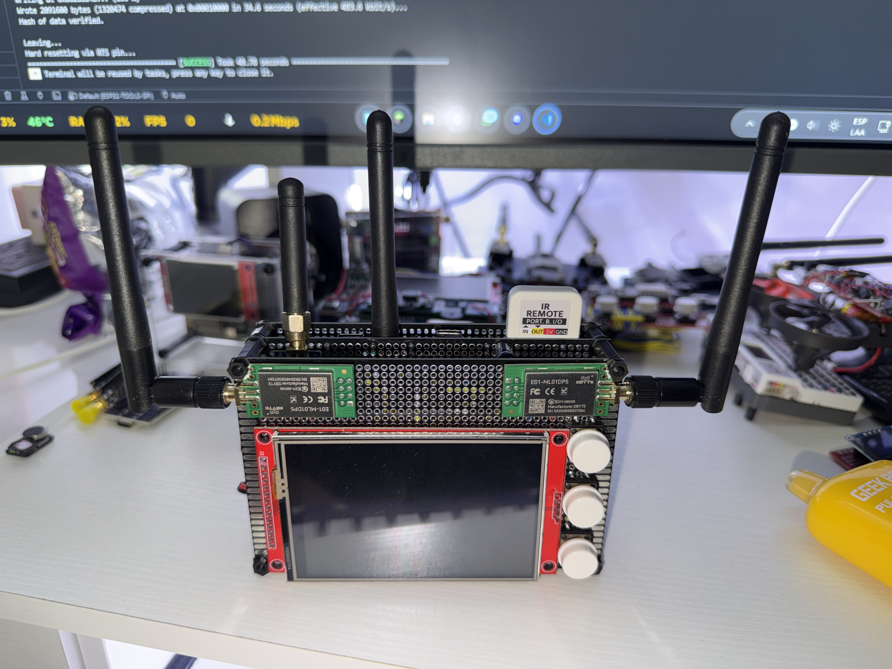 |
| Front view |  |
| Side view | 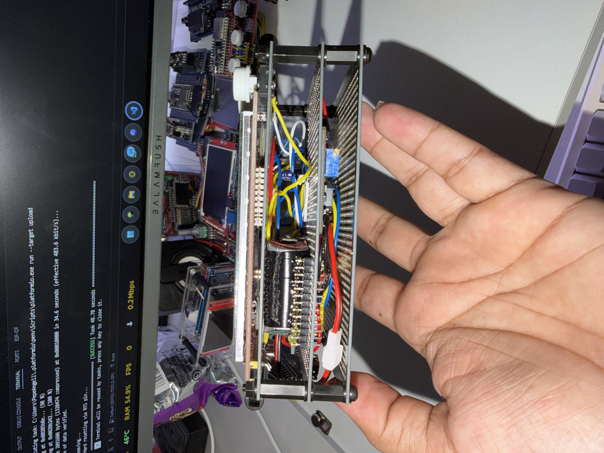 |
| Internal view / assembly | 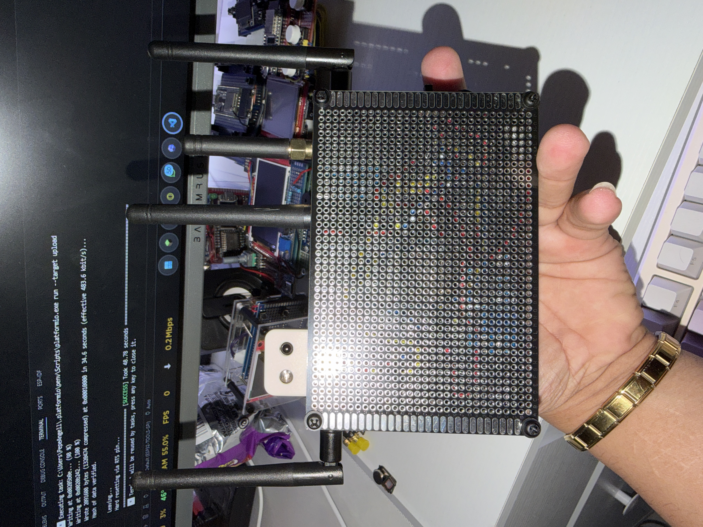 |

[Back to table of contents](#table-of-contents)

## Firmware Screenshots

| Menu | Image |
| --- | --- |
| Splash |  |
| Main menu |  |
| WiFi Tools | 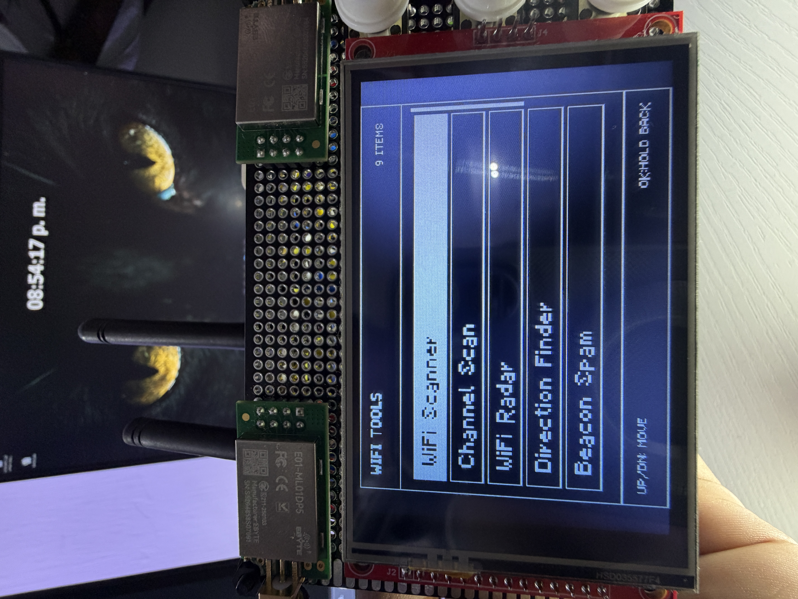 |
| WiFi scanner / channels | 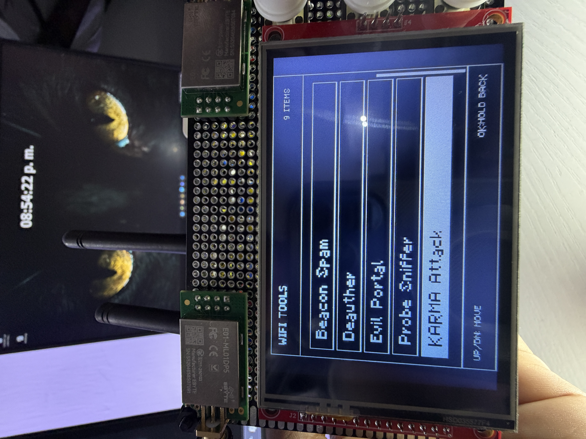 |
| Radio Tools |  |
| Bluetooth Tools |  |
| Packet Monitor | 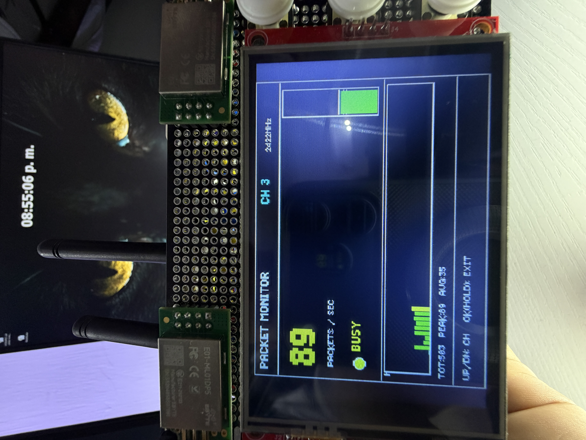 |
| System Tools |  |
| Screensaver | 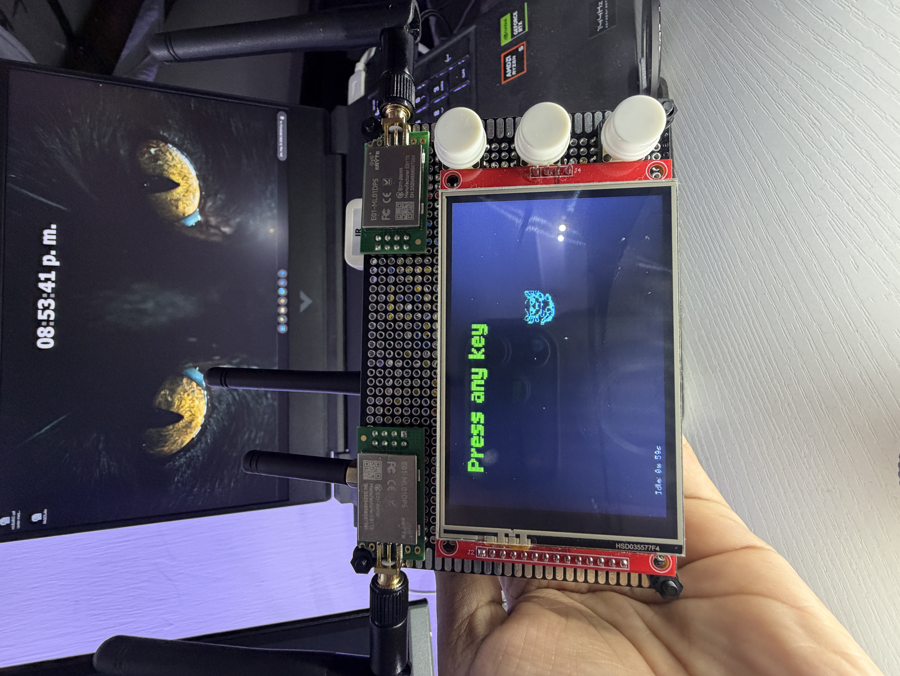 |

[Back to table of contents](#table-of-contents)

## Navigation

- `UP`: move up or change a value.
- `DOWN`: move down or change a value.
- `OK`: enter, select, capture, or perform an action.
- Hold `OK`: go back, cancel, or exit the current screen.
- Submenus remember the option you were on when returning.

[Back to table of contents](#table-of-contents)

## Main Features

### WiFi Tools

- `WiFi Scanner`: scans nearby 2.4 GHz WiFi networks and displays SSID, BSSID, channel, RSSI, frequency, and security.
- `Channel Scan`: groups networks by channel, shows how many networks are on each channel, and lets you open the AP list for a channel.
- `WiFi Radar`: lets you choose an AP and track it by RSSI, proximity percentage, peak, trend, and history.
- `WiFi Direction Finder`: measures RSSI by sector to estimate the direction from which a network is strongest.
- `WiFi Config`: connects the ESP32 to a network using the virtual keyboard and stores credentials in NVS.
- `Beacon Spam`: transmits test beacons for controlled laboratory use.
- `Deauther`: WiFi testing tool for authorized environments.
- `Evil Portal`: educational captive portal for demonstrating phishing flows in your own lab.
- `Probe Sniffer`: observes nearby WiFi probes and displays detected activity.
- `KARMA Attack`: educational mode for understanding responses to probes and insecure associations.

Important limitation: the ESP32-S3 only supports 2.4 GHz WiFi. It cannot scan 5 GHz networks.

### Radio Tools

- `Jammer`: updated mode for 2.4 GHz testing in your own lab. It lets you choose a WiFi channel, start/stop with `OK`, and uses both nRF24L01 modules when available.
- `Radio Scanner`: visual 2.4 GHz analyzer with spectrum, channel activity, and waterfall-style views.
- `Signal Tools`: IR tools and basic pin diagnostics.
- `CC1101`: dedicated sub-GHz menu with diagnostics, spectrum, monitor, finder, and RF analysis.

### Signal Tools / IR

- `Hardware Diag`: displays pins, SPI status, RX levels, and general hardware status.
- `Input Monitor`: displays activity on IR RX and CC1101 GDO0 to validate wiring.
- `IR Raw Capture`: captures raw signals from infrared remotes.
- `IR Replay`: replays the last capture using a 38 kHz IR carrier.
- `IR TX Test`: emits three IR flashes to validate the transmitter with a phone camera.
- `Saved Captures`: stores named IR captures and lets you load, replay, rename, or delete them.
- `IR Remotes`: creates virtual remotes with buttons linked to saved captures.
- `IR Analyzer`: live IR activity detector with `IDLE`, `FRAME`, `REPEAT`, and `NOISE` states.
- `Protocol Scan`: attempts to classify the signal as NEC, Samsung, LG, Sony, Panasonic, RC5, RC6, or RAW.
- `IR Sniffer`: records live IR events with protocol, code, bits, duration, and repetitions.
- `Night IR`: detects pulsed/modulated IR activity from remotes, IR LEDs, sensors, or cameras with pulsed IR.
- `IR Proximity`: experimental IR reflection test. It does not measure actual distance and depends heavily on the physical setup.

IR notes:

- Many mini-split and air-conditioning units use long codes containing complete state information. Increasing temperature, decreasing temperature, turning on, and turning off may all be completely different captures.
- The demodulated IR receiver does not measure actual analog intensity or exact carrier frequency. The bars show detected activity, not precise optical power.
- For reliable captures, point the remote directly at the receiver and avoid strong IR light nearby.

### CC1101 Tools

- `Hardware Diag`: verifies SPI communication, `PARTNUM`, `VERSION`, `MARCSTATE`, RSSI, LQI, and GDO0 level.
- `Spectrum Scan`: sweeps common 315, 433, 868, and 915 MHz bands to show RSSI peaks.
- `Waterfall`: historical view of RF activity by frequency.
- `Frequency Mon`: monitors a fixed frequency such as 315.00, 390.00, 433.92, 868.35, or 915.00 MHz.
- `Freq Finder`: calibrates noise and automatically searches for the peak of a sub-GHz signal.
- `Brute Search`: broad search for finding candidate activity.
- `Code Check`: compares multiple button presses to see whether a signal appears fixed or changing.
- `RF Analyzer`: displays pulses, total duration, short/long averages, OOK/ASK type, and signature/hash.
- `RF Raw View`: captures and draws the signal as bars/pulses for comparing buttons.
- `RF Live`: live detector with frequency, peak RSSI, event counter, and last activity.
- `Lab Replay`: OOK/ASK RF replay only for your own fixed-code devices and laboratory testing.
- `Test Beacon`: short test transmission for validating RF output in a controlled environment.

CC1101 notes:

- `433.92 MHz` and `434 MHz` usually refer to the same practical range. Many remotes are advertised as 434 even though they operate near 433.92 MHz.
- The frequency meter is approximate. It does not replace a professional spectrum analyzer.
- Do not use RF replay on cars, gates, alarms, locks, or systems belonging to others. Many use rolling codes and must not be copied or tested outside your own lab.

### Bluetooth Tools

- `BLE Device Radar`: scans BLE, shows name, MAC, RSSI, manufacturer/type, and lets you track a target with history.
- `BLE Inspector`: enhanced scanner with classification by manufacturer, appearance, device type, and services.
- `iPhone Remote`: experimental BLE HID mode for pairing and basic control of your own devices.
- `BLE Spam`: educational BLE testing in a laboratory.
- `BT Disruptor`: controlled Bluetooth laboratory testing.
- `BT Jammer`: 2.4 GHz sweep with dual nRF24L01 modules for short-range educational testing in your own environment.

### System Tools

- `Settings`: device configuration and saved options.
- `System Info`: memory, firmware, and ESP32 status information.
- `Clock & Weather`: clock/weather with a virtual keyboard for configuration.
- `Web Dashboard`: creates the `ESP32-TOOLS-PRO` AP with password `admin1234` and opens a web panel at `http://192.168.4.1`.
- `About`: project information.

### Web Dashboard

Phase 1 of the web dashboard is activated from `System > Web Dashboard`. When opened, the ESP32 starts its own AP:

```text
SSID: ESP32-TOOLS-PRO
PASS: admin1234
URL : http://192.168.4.1
```

Available in phase 1:

- General dashboard with uptime, free heap, connected clients, and main pins.
- Quick diagnostics for IR RX and CC1101 GDO0 levels.
- List of saved IR captures with replay, rename, and delete.
- CC1101 monitor by preset frequency: 315.00, 390.00, 433.92, 868.35, and 915.00 MHz.
- WiFi Tools from a browser:
  - `WiFi Scanner`: list of networks, channel, RSSI, security, and BSSID.
  - `Channel Scan`: per-channel summary and 2.4 GHz network table.
  - `WiFi Radar`: selects an AP and tracks it by RSSI/proximity.
  - `Direction Finder`: measures front, right, back, and left to suggest the strongest direction.
  - `Beacon Spam`: controlled web demo with laboratory SSIDs, a dashboard-fixed channel, start/stop button, and auto-stop.
  - `Deauther`, `Evil Portal`, `Probe Sniffer`, and `KARMA Attack` appear as `LOCAL ONLY` and must be used from the device screen.
- Bluetooth / Radio from a browser:
  - `BT Jammer`: can be started and stopped directly from the web dashboard, without physical confirmation on the device. Use it only in your own short-range laboratory environment.

The dashboard keeps functions that take full control of WiFi, such as Deauther, Evil Portal, and KARMA, as `LOCAL ONLY` to avoid conflicts with the dashboard AP. `BT Jammer` is the current exception: it can run from the web panel because it uses the nRF24L01 modules and does not need physical confirmation.

[Back to table of contents](#table-of-contents)

## Components Used

| Component | Description | Recommended Voltage | Notes |
| --- | --- | --- | --- |
| ESP32-S3 DevKitC-1 | Main project microcontroller | USB/5V on board | 3.3V GPIO logic |
| TFT 480x320 ILI9488 SPI | Main display | Depends on module, commonly 5V or 3.3V | 3.3V SPI signals |
| nRF24L01 #1 | Main 2.4 GHz radio | 3.3V | Do not power with 5V |
| nRF24L01 #2 | Secondary 2.4 GHz radio | 3.3V | Capacitor near VCC/GND recommended |
| M5Stack IR Unit | Infrared receiver + transmitter | 5V | Wiring verified with OUT on GPIO14 and IN on GPIO15 |
| CC1101 | Sub-GHz radio for 315/433/868/915 MHz | 3.3V | Do not power with 5V |
| UP/OK/DOWN buttons | Firmware navigation | GPIO to GND | Uses internal `INPUT_PULLUP` |

### Component Images

| Component | Image |
| --- | --- |
| ESP32-S3 DevKitC-1 | 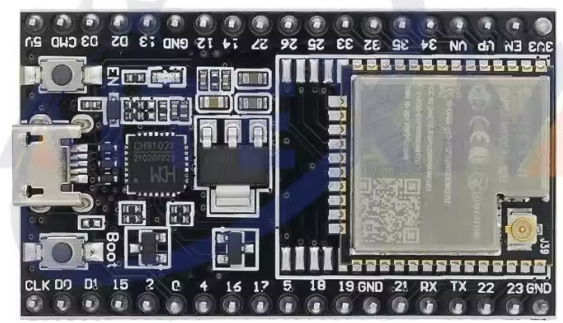 |
| ILI9488 480x320 display | 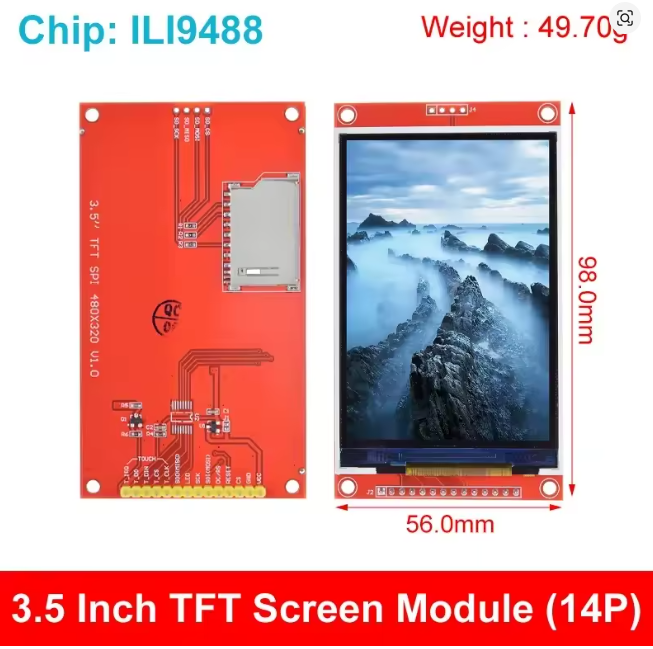 |
| nRF24L01 modules | 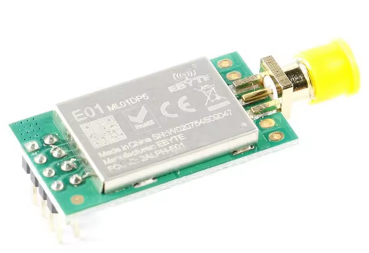 |
| nRF24L01 |  |
| CC1101 | 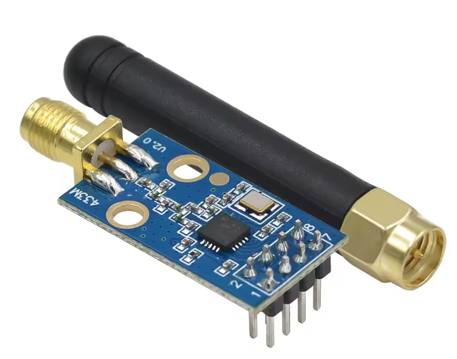 |
| Antenna | 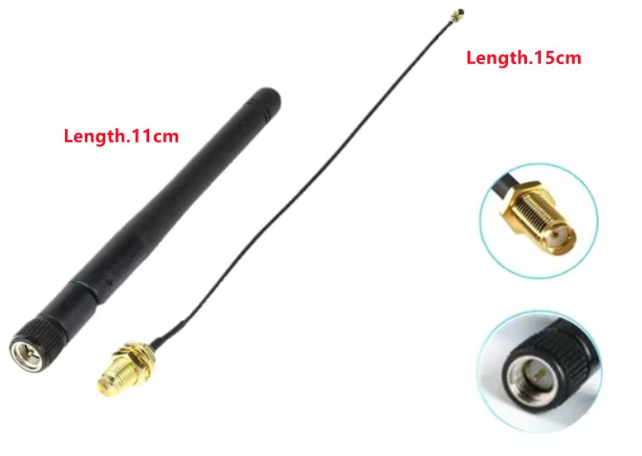 |
| M5Stack IR Unit | 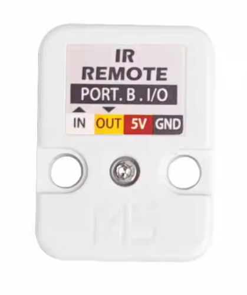 |
| IR Unit view 2 | 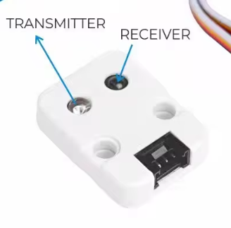 |
| Buttons |  |
| Battery |  |
| TP4056 |  |
| Step-up | 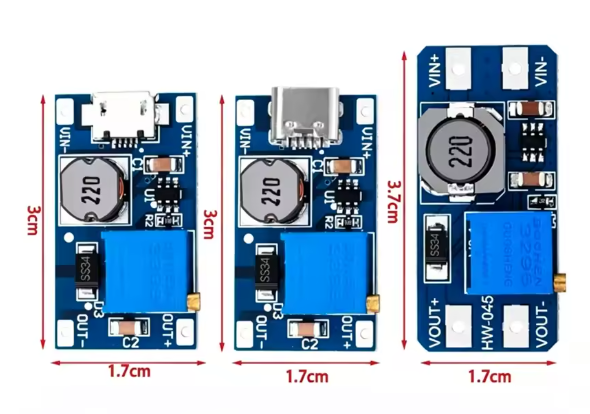 |
| Switch |  |
| PCB / assembly |  |

### Complete Wiring Diagrams

These diagrams show block-level wiring to make soldering and checking the assembly easier without overcrowding a single image.

#### TFT Display and Buttons


#### nRF24L01 Modules

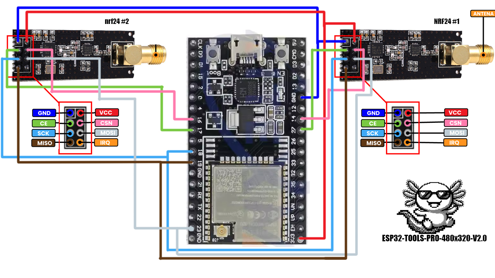

#### CC1101 and IR Remote


### Reference Pinouts

| Module | Pinout |
| --- | --- |
| nRF24L01 PA + LNA |  |
| CC1101 |  |

[Back to table of contents](#table-of-contents)

## Wiring Table

All modules must share `GND` with the ESP32. Do not connect any 3.3V module to 5V.

### Shared SPI Bus

| Signal | ESP32-S3 GPIO | Used by |
| --- | ---: | --- |
| SCK | GPIO12 | TFT, nRF24 #1, nRF24 #2, CC1101 |
| MOSI | GPIO11 | TFT, nRF24 #1, nRF24 #2, CC1101 |
| MISO | GPIO13 | nRF24 #1, nRF24 #2, CC1101 |

Each SPI module has its own `CS/CSN` pin, so they can share SCK/MOSI/MISO.

### 480x320 TFT Display

| TFT Pin | ESP32-S3 GPIO | Note |
| --- | ---: | --- |
| CS | GPIO10 | TFT chip select |
| RST | GPIO8 | TFT reset |
| DC / RS | GPIO9 | Data/Command |
| LED / BL | GPIO3 | Backlight |
| SCK / CLK | GPIO12 | Shared SPI |
| MOSI / SDI | GPIO11 | Shared SPI |
| MISO / SDO | Not used by TFT | Firmware sets TFT MISO to `-1` |
| VCC | Depends on module | Check your display: some accept 5V, others 3.3V |
| GND | GND | Common ground |

### nRF24L01 #1

| nRF24 Pin | ESP32-S3 GPIO | Note |
| --- | ---: | --- |
| CE | GPIO4 | Radio #1 control |
| CSN | GPIO6 | Radio #1 chip select |
| SCK | GPIO12 | Shared SPI |
| MOSI | GPIO11 | Shared SPI |
| MISO | GPIO13 | Shared SPI |
| VCC | 3.3V | Do not use 5V |
| GND | GND | Common ground |

### nRF24L01 #2

| nRF24 Pin | ESP32 GPIO | Note |
| --- | ---: | --- |
| CE | GPIO5 | Radio #2 control |
| CSN | GPIO7 | Radio #2 chip select |
| SCK | GPIO12 | Shared SPI |
| MOSI | GPIO11 | Shared SPI |
| MISO | GPIO13 | Shared SPI |
| VCC | 3.3V | Do not use 5V |
| GND | GND | Common ground |

### M5Stack IR Unit

| IR Module Pin | ESP32-S3 GPIO | Firmware Function | Note |
| --- | ---: | --- | --- |
| OUT | GPIO14 | `IR_TX_PIN` | ESP32 output to the module's IR transmitter |
| IN | GPIO15 | `IR_RX_PIN` | ESP32 input from the module's IR receiver |
| 5V | 5V | Power | The M5Stack IR module operates at 5V |
| GND | GND | Common ground | Ground must be shared |

GPIO15 is used for IR reception. GPIO14 is used for transmission.

### CC1101

| CC1101 Pin | ESP32-S3 GPIO | Firmware Function | Note |
| --- | ---: | --- | --- |
| CSN / CS | GPIO16 | `CC1101_CSN_PIN` | CC1101 chip select |
| SCK | GPIO12 | Shared SPI | SPI clock |
| MOSI / SI | GPIO11 | Shared SPI | Data from ESP32 to CC1101 |
| MISO / SO | GPIO13 | Shared SPI | Data from CC1101 to ESP32 |
| GDO0 | GPIO38 | `CC1101_GDO0_PIN` | RF RX/edge input |
| Extra GDO2 | GPIO39 | `CC1101_TX_DATA_PIN` | Optional jumper for `Lab Replay` |
| VCC | 3.3V | Power | Do not use 5V |
| GND | GND | Common ground | Ground must be shared |

The `GDO0 extra -> GPIO39` jumper is only needed for `Lab Replay` testing. You can omit it if you only use diagnostics, monitor, finder, analyzer, and raw view.

### Buttons

| Button | ESP32-S3 GPIO | Wiring |
| --- | ---: | --- |
| UP | GPIO1 | Button between GPIO1 and GND |
| OK | GPIO2 | Button between GPIO2 and GND |
| DOWN | GPIO21 | Button between GPIO21 and GND |

The buttons use the internal pull-up. When pressed, the pin goes `LOW`.

[Back to table of contents](#table-of-contents)

## Visual Wiring Diagram

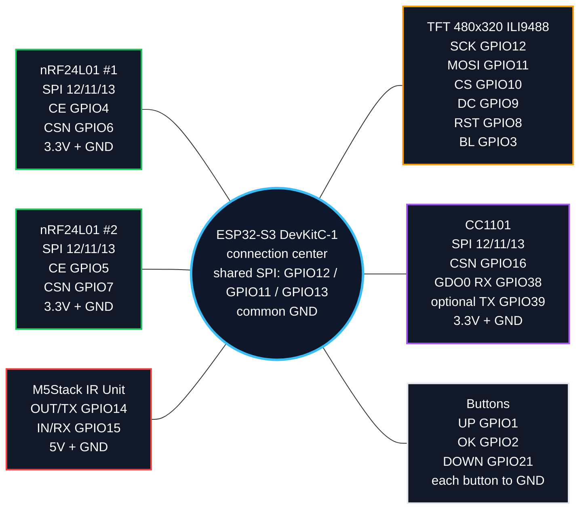

[Back to table of contents](#table-of-contents)

## Quick Pin Map

```text
ESP32-S3 GPIO12  -> shared SPI SCK
ESP32-S3 GPIO11  -> shared SPI MOSI
ESP32-S3 GPIO13  -> shared SPI MISO

ESP32-S3 GPIO10   -> TFT CS
ESP32-S3 GPIO8   -> TFT RST
ESP32-S3 GPIO9  -> TFT DC
ESP32-S3 GPIO3  -> TFT Backlight

ESP32-S3 GPIO4  -> nRF24 #1 CE
ESP32-S3 GPIO6  -> nRF24 #1 CSN
ESP32-S3 GPIO5  -> nRF24 #2 CE
ESP32-S3 GPIO7  -> nRF24 #2 CSN

ESP32-S3 GPIO14  -> IR OUT / TX
ESP32-S3 GPIO15  -> IR IN / RX

ESP32-S3 GPIO16  -> CC1101 CSN
ESP32-S3 GPIO38  -> CC1101 GDO0 RX
ESP32-S3 GPIO39  -> CC1101 optional GDO0 TX for Lab Replay

ESP32-S3 GPIO1  -> UP button to GND
ESP32-S3 GPIO2  -> OK button to GND
ESP32-S3 GPIO21  -> DOWN button to GND
```

[Back to table of contents](#table-of-contents)

## Web Flasher

Flash directly from a browser:

[https://pepeangell5.github.io/ESP32-TOOLS-PRO-480x320-V2.0/](https://pepeangell5.github.io/ESP32-TOOLS-PRO-480x320-V2.0/)

The page uses ESP Web Tools and these repository files:

- `index.html`: flashing page with ESP Web Tools.
- `manifest.json`: manifest used by ESP Web Tools.
- `assets/Firmware/firmware-merged.bin`: complete binary to flash from offset `0x0`.
- `assets/Firmware/firmware.bin`: compiled application.
- `assets/Firmware/bootloader.bin`: bootloader.
- `assets/Firmware/partitions.bin`: partition table.

Target repository:

```text
https://github.com/pepeangell5/ESP32-TOOLS-PRO-480x320-V2.0
```

[Back to table of contents](#table-of-contents)

## Wokwi Demo

The repository includes `diagram.json` and `wokwi.toml` for an ESP32-S3 demo with an SPI display and the three navigation buttons. Build the firmware first, then open the repository in Wokwi and start the simulation.

```bash
python -m platformio run -e esp32s3dev
```

The Wokwi demo covers boot, splash screen, menus, and button navigation. The nRF24L01, CC1101, and IR hardware functions require the real modules and are not fully simulated.

[Back to table of contents](#table-of-contents)

## Build and Upload with PlatformIO

Build:

```bash
pio run
```

Upload to the ESP32:

```bash
pio run -t upload --upload-port COM3
```

If uploading fails with a boot/serial error, hold `BOOT` while starting the upload and release it when PlatformIO begins writing.

[Back to table of contents](#table-of-contents)

## Known Limitations

- WiFi is 2.4 GHz only because the ESP32-S3 does not have a 5 GHz radio.
- The CC1101 provides approximate RSSI/frequency readings; it is not a professional spectrum analyzer.
- `IR Proximity` is experimental and may remain at `NONE` depending on the angle and physical reflection.
- Air conditioners usually use long signals with complete state information; save each function separately.
- `Jammer`, `BT Jammer`, `BLE Spam`, `BT Disruptor`, `Deauther`, `KARMA`, and `Beacon Spam` are laboratory functions. They can degrade nearby communications and must be used only with authorization.
- `Lab Replay` RF is intended for lights, outlets, or your own fixed-code devices. It is not for vehicles, alarms, locks, or gates.
- The RF433T/RF433R modules are excluded from V2.0.

[Back to table of contents](#table-of-contents)

## Credits

Project created and tested by PepeAngell for ESP32-TOOLS-PRO-480x320-V2.0.

[Back to table of contents](#table-of-contents)

## Social and Links

- GitHub: [github.com/pepeangell5](https://github.com/pepeangell5)
- Web Flasher: [pepeangell5.github.io/ESP32-TOOLS-PRO-480x320-V2.0](https://pepeangell5.github.io/ESP32-TOOLS-PRO-480x320-V2.0/)
- Instagram: [@esp32_tools](https://instagram.com/esp32_tools)
- Facebook: [ESP32Tools](https://www.facebook.com/esp32tools/)
[Back to table of contents](#table-of-contents)

[Back to top](#esp32-tools-pro-480x320-v20)
